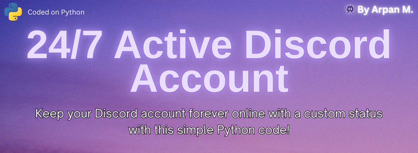

# **🟢 Stay Online on Discord Forever**

**A simple project to keep your Discord account online 24/7 using a Flask web server, with any Uptimer service support.**

<p align="center">
  
</p>

## **Table of Contents**
1. [About the Project](#-about-the-project)
2. [How It Works](#%EF%B8%8F-how-it-works)
3. [Video Tutorial](#-video-tutorial)
4. [Getting Started](#-getting-started)
5. [Installation](#-installation)
6. [Running the Code 24/7](#-running-the-code-247)
7. [Features](#-features)
8. [Important Information](#-important-information)
9. [Contact Us](#-contact-us)

---

## **📕 About the Project**

This project allows you to keep your Discord account forever online with a custom status. It can be hosted through Repl.it and later on, any Uptimer service can be used to keep the Repl running 24/7. 

> ⚠️ This project is made for educational purposes only. Please read Discord's TOS before attempting to use this code.

---

## **⁉️ How It Works**

1. **Discord Token Authentication**: The script retrieves your Discord user token from the environment variables on Replit.
2. **WebSocket Connection**: It uses a WebSocket connection to Discord’s gateway, setting the account status to **online**.
3. **Flask Web Server**: A simple web server runs on Replit, serving as a heartbeat for UptimeRobot to keep the Replit instance alive.
4. **UptimeRobot Integration**: You can ping the web server using UptimeRobot to ensure the service stays running indefinitely.

---

## **💻 Video Tutorial**

  **Watch the Installation Tutorial on our official YouTube channel to make things easier**: [Watch Now](https://www.youtube.com/)

---

## **🔷 Getting Started**

### **Prerequisites**

- [Replit Account](https://replit.com/)
- [Discord Account](https://discord.com/) 
- [UptimeRobot Account](https://uptimerobot.com/) or any other Uptimer Service Account

---

## **🚀 Installation**

1. **Fork the repository to Repl.it**:
- Login/Sign Up in [Replit](https://replit.com/) and click `Import from GitHub`.
- Select "🔗 From URL" and paste the Repository URL in the bar and click Import button present below.
```bash
https://github.com/TriplCore/24x7-Online-Discord
```
2. **Extract your Discord user token by the following process:**
- Open your Discord in a browser(recommended) or the client itself(not recommended).
- Open up Developer tools by pressing `F12` on your keyboard.
- Go to console and paste the code as provided below.
     ```bash
     (webpackChunkdiscord_app.push([[''],{},e=>{m=[];for(let c in e.c)m.push(e.c[c])}]),m).find(m=>m?.exports?.default?.getToken!==void 0).exports.default.getToken()
     ```
- It will throw your Discord User Token that you are currently logged in. <br></br>
3. **Put your User Token in Replit**
- Go to Tools > Secrets, then create a new secret with `Key` as `DISCORD_TOKEN` and `Value` as your `Discord User Token`.
- Click add secret.<br></br>
4. **Configure & Run the Repl**
  - Configure the user status and custom status you want to put. [`Line 18 & Line 19`]
  - Click the `▶️Run` button and see your account come online with your specified user status and custom status. <br></br>

---

## **🔁 Running the Code 24/7**

**After the Repl is up and running, you have to enable it to run 24/7 using the below process:**
- Go to any Uptimer service, for example [UptimeRobot](https://uptimerobot.com) and Login/Sign Up.
- Create a new monitor in UptimeRobot:
- Set the monitor type to HTTP(s).
- Enter the URL provided by your Flask server.
- Set the monitoring interval to every 5 minutes.
- Enjoy your Discord account being always active! 

---

## **🚥 Features**

- **Persistent Online Status:** Keep your Discord account online continuously with a customizable status.
- **Flask Web Server:** A lightweight web server that allows for easy Uptimer integration.
- **Customizable Status:** Set a personalized user status and custom status message to show on your Discord profile.
- **Simple Setup:** Quick and easy to configure with clear instructions for beginners.
- **No Data Breach:** No backdoors and hidden User Token in our code means your Data remains with you.

---

## **🚩 Important Information**

- > ❕ It takes 2-4 minutes for your account to go offline after you turn off the code in ReplIt. Hence, changes made will occur only after that duration. <p>
- > ‼️ Do not share your Discord user token with anyone else, as it can lead to the compromise of your account!

---

## **👋 Contact Us**
 **Have issues or doubts? We are always open to talk with!**
- **[Join Our Discord Server](https://discord.gg/invite/C39jUUJM8N)**
- **[Subscribe to our YouTube](https://www.youtube.com/@TheThirdElement)**

---

👾 Made by Arpan M | Co-Founder, The Third Element
